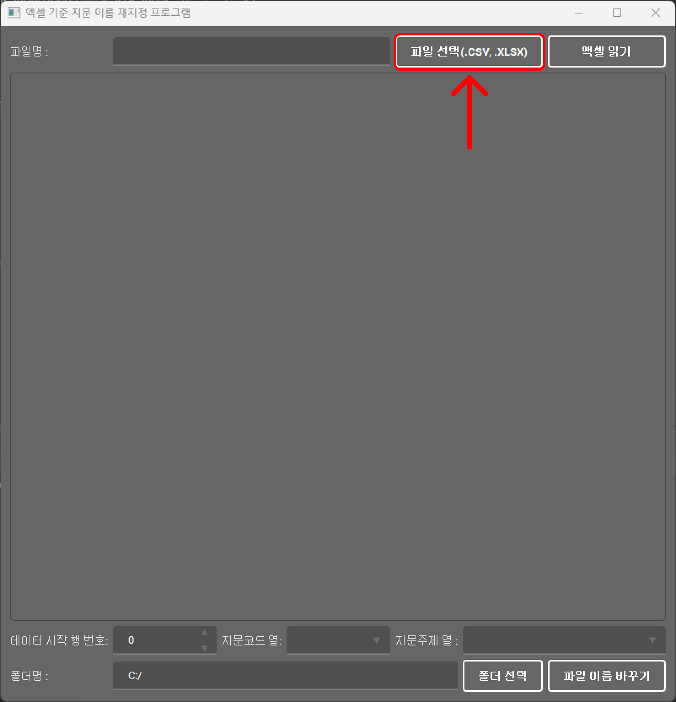

# 지문 DB 엑셀기반 지문코드 파일명 변환 프로그램

**엑셀형식 파일(.xlsx, .csv)**을 불러와서 지문 코드열, 주제열을 각각 선택해주면 해당 작업에 맞게 지정한 폴더 하위에 있는 모든 파일의 코드 부분을 재지정해주는 프로그램입니다.

### 첫 실행

처음 실행하면 아래와 같이 프로그램 창이 띄워집니다.

우측 상단의 파일 선택 버튼을 눌러서 지문 **코드**와 **주제** 열(column)을 지정할 수 있는 파일을 불러와 주세요.

다음으로 엑셀 읽기 버튼을 눌러서 파일에 담겨있는 내용들을 불러오면 아래와 같이 나타납니다.

여기서 지문 코드와 지문 주제의 열의 이름이 각각 UNNAMED: 1과 10이기 때문에 **“지문코드 열”**과 **“지문주제 열”**을 그에 맞게 지정해줍니다. 또한 데이터가 1행부터 시작하기 때문에 **“데이터 시작 행 번호”**도 1로 맞춰 지정해줍니다. 정리하면 아래와 같습니다.

**예시**

- **데이터 시작 행 번호: 1**
- **지문코드 열: Unnamed: 1**
- **지문주제 열: 10**

마지막으로, 지문 코드명 변환을 진행하고 싶은 폴더에 대해서 “폴더선택 버튼을 통해서” 지정해주고, 파일 이름 바꾸기 버튼을 눌러 작업을 수행하시면 끝입니다!

아래는 실행 전과 후 결과 입니다.

### 실행 전

### 실행 후

